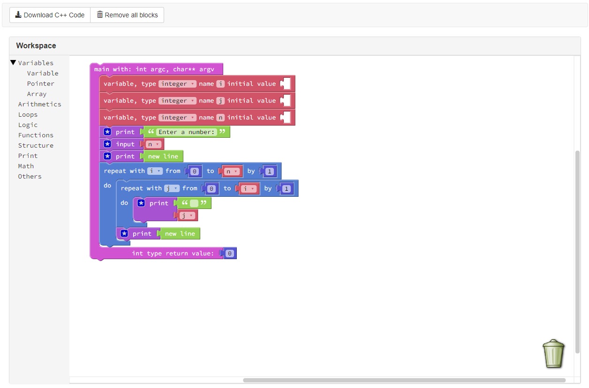

# Blockly-to-C++

Blockly to C++ can generate code from blocks for C++ languages. A language generator defines the rules for generating a specific language. The Blockly library adds an editor to your app that represents coding concepts as interlocking blocks. Blockly generates simple, syntactically-correct code generate. The Blockly library adds an editor to your app that represents coding concepts as interlocking blocks. Blockly is free and open source. Go integrate Blockly into your projects as a friendly UI. It is also more than just for programming UIs (e.g. Blockly Puzzle). Google's Blockly is a library that adds a visual code editor to web and mobile apps. The Blockly editor uses interlocking, graphical blocks to represent codes.
### Link: 
https://blockly-to-cpp.mdanisuranisur.repl.co/
